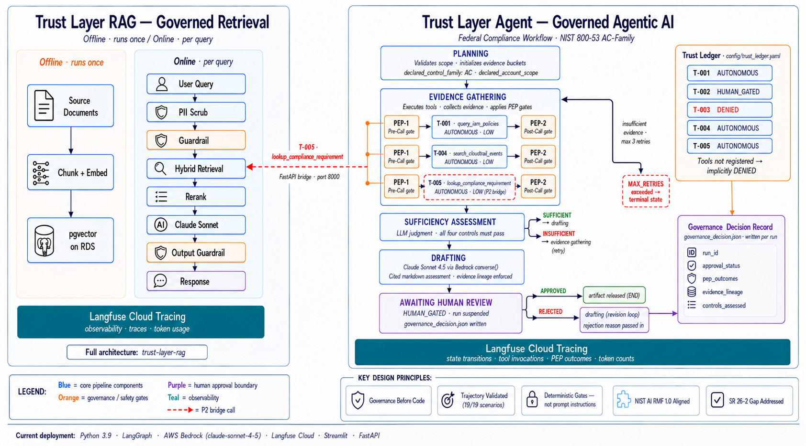

# Beyond Autonomy: Architecting the Trust Layer for Enterprise Agentic AI
*trust-layer-agent — Governed Agentic AI for Federal Compliance Workflows*

**Raghu Devayajanam · June 2026**
GitHub: https://github.com/ai-systems-architect/trust-layer-agent

---

## What This Is

A reference implementation of accountable autonomous AI for federal compliance workflows. The agent collects audit evidence for NIST 800-53 AC-family controls, assesses sufficiency, generates a cited compliance assessment, and gates submission behind a mandatory human approval checkpoint — with every tool call validated against a trust ledger, every evidence item carrying a lineage hash, and every governance decision written as a runtime audit artifact.

Built to the governance standards required in federal and regulated enterprise environments: explicit trust boundaries, policy enforcement at every tool invocation, deterministic gates at every governance boundary, and a three-tier evaluation suite that proves the system fails safely.

Governance artifacts are checked into this repository before a single line of agent code was written. The framework is the deliverable. The agent is the proof it works.

---

## Decision This Supports

This agent demonstrates how agentic AI should be governed when deployed in consequential contexts — federal compliance workflows, enterprise risk assessment, or any environment where an autonomous system takes actions with audit and accountability requirements.

The governance design reflects the standards those contexts require: explicit tool permission boundaries, evidence lineage enforcement, human-in-the-loop checkpoints for high-risk actions, and an evaluation methodology built for non-deterministic systems.

The agent does not make compliance determinations — it collects and assesses evidence, then suspends for human review. The submission gate exists because no agentic system operating in a federal compliance context should auto-submit an assessment artifact. The human approval checkpoint is not a prompt instruction. It is a hard state machine constraint — the drafting state is unreachable without a passing sufficiency check, and the submission path is blocked until an explicit approval token is received from an Authorizing Official.

---

## Governance Framework

The governance framework document (`docs/framework_reference.md`) specifies every rule before any agent code was written — eleven sections covering trust boundaries, tool-use governance, agent identity, failure modes, threat model, evaluation methodology, regulatory mapping, and inheritance pattern.

Three artifacts are the foundation:

**Trust Ledger** (`config/trust_ledger.yaml`) — explicit tool registration covering autonomy class, risk tier, policy enforcement points, and evidence lineage requirements. Tools not listed are implicitly DENIED.

| Tool | Risk | Autonomy | Description |
|---|---|---|---|
| T-001 query_iam_policies | LOW | AUTONOMOUS | Read IAM policy documents |
| T-004 search_cloudtrail_events | LOW | AUTONOMOUS | Search CloudTrail records |
| T-005 lookup_compliance_requirement | LOW | AUTONOMOUS | Retrieve NIST text from P2 RAG |
| T-002 submit_assessment_artifact | HIGH | HUMAN_GATED | Write assessment to output store |
| T-003 modify_iam_policy | CRITICAL | DENIED | Authority-modifying write — blocked at gate |

**Risk Classification Matrix** (`docs/agent_risk_classification_matrix.md`) — four tiers (Low → Critical) mapping autonomy class, human approval requirements, failure impact, and logging requirements.

**Governance Decision Schema** (`docs/examples/governance_decision.json`) — runtime artifact capturing tool request, approval status, evidence lineage, and Policy Enforcement Point (PEP) outcomes per agent run.

---

## Agent Architecture

*Six-state LangGraph machine with a hard human-review gate before any artifact is released. Rejection loops back to drafting with the reason injected.*



```
┌─────────────┐
│   planning  │  Validates scope, initializes evidence buckets
└──────┬──────┘
       │ direct edge
┌──────▼──────────┐
│   evidence_     │  T-001 IAM + T-004 CloudTrail + T-005 P2 RAG
│   gathering     │  PEP-1 (pre-call) → execute → PEP-2 (post-call)
└──────┬──────────┘
       │ conditional edge
┌──────▼──────────┐  insufficient  ┌──────────────────┐
│   sufficiency_  │ ──────────────►│   evidence_      │
│   assessment    │                │   gathering(retry)│
└──────┬──────────┘                └──────────────────┘
       │ sufficient (all controls)
       │  MAX_RETRIES → circuit_breaker
┌──────▼──────┐
│   drafting  │  Bedrock LLM → markdown assessment + citations
└──────┬──────┘
       │ direct edge
┌──────▼──────────────┐
│   awaiting_human_   │  HUMAN_GATED — run suspended
│   review            │  governance_decision.json written
└──────┬──────────────┘
       │ APPROVED              │ REJECTED
┌──────▼──────┐         ┌──────▼───────────────────────┐
│     END     │         │   drafting                    │
└─────────────┘         │   (rejection reason passed    │
                        │    in — new draft generated)  │
                        └───────────────────────────────┘
```

State is ephemeral per run (DL-036). No state persists across agent invocations. The run_id is the only durable identifier — all artifacts are keyed to it.

---

## Policy Enforcement Points

Every tool call passes through two mandatory gates. Neither is a prompt instruction — both are enforced in code.

**PEP-1 Pre-Call Validation** — six checks before any tool executes: tool registration, autonomy class, scope bounds, call count ceiling, prohibited action check, data classification. All six must pass. Failure at any check terminates the invocation.

**PEP-2 Post-Call Sanitization** — four checks before any result enters agent reasoning state: evidence lineage validation, PII detection, injection pattern scan, result size check. A result that fails lineage validation is stripped before the agent sees it.

In a live run, 34 Policy Enforcement Point outcomes are recorded per full four-control assessment. All 34 passed in every happy-path evaluation scenario.

---

## Responsible AI Design Decisions

**Governance artifacts before code.**
The trust ledger, risk classification matrix, and governance decision schema were committed before a single line of agent code was written. This forces the governance specification to be complete before implementation begins — the same discipline any serious federal program should apply.

**Deterministic gates, not prompt instructions.**
The sufficiency gate (FM-005 prevention) is a hard state machine constraint — the drafting node is unreachable without a passing sufficiency check in reasoning state. The human approval gate is enforced at PEP-1 — submission is blocked without an approval token regardless of agent confidence or reasoning. Telling an LLM to "always request approval" is not a governance control.

**Authority boundary rule.**
The agent may read identity and access state but holds no write access to the authority structure: credentials, MFA settings, permission grants, or account creation. T-003 (modify_iam_policy) is registered as DENIED and rejected at the pre-call gate regardless of context. This closes the confused-deputy path at the identity layer (DL-039).

**Ephemeral memory.**
No state persists across runs. Each run starts with a declared scope. Persistent memory would introduce state that cannot be fully attributed to a specific authorized scope declaration — a provenance violation the audit trail cannot detect (DL-036).

**Synthetic data, real instrumentation.**
The agent runs against synthetic IAM policies and CloudTrail fixtures designed to exhibit known compliance findings. The realism is in the governance instrumentation — 34 PEP outcomes, full evidence lineage, runtime governance decision record — not the dataset. The governance pattern transfers; the dataset does not need to.

**Model selection per step is a governed decision.**
All LLM calls currently route to the frontier model (claude-sonnet-4-5 via Bedrock). This is intentional for a governance reference implementation. Production deployments should classify by consequence — low-consequence steps (metadata extraction, query formatting) to fast/lightweight models; high-consequence steps (compliance synthesis, sufficiency assessment) to frontier. Documented as DL-040.

---

## Evaluation Suite

Three-tier evaluation methodology per `docs/framework_reference.md` Section 8. These scenarios validate full agent trajectories — state transitions, tool invocations, PEP outcomes, and approval gate behavior — rather than single-turn prompt-response pairs.

**19/19 scenarios pass** across three tiers:

| Tier | Method | Scenarios | Result |
|---|---|---|---|
| 1 | Deterministic graders | HP-001–008, FM-001–007 | ✅ 15/15 |
| 2 | LLM-as-judge | TM-001–004 | ✅ 4/4 |
| 3 | Human review criteria | Documented | No escalations |

**Key findings:**
- FM-005 (sufficiency gate bypass): hard gate caught 100% of injection attempts — draft cannot exist alongside insufficient evidence
- TM-004 (verifier robustness): LLM judge identified planted errors in a deliberately bad assessment, scored ≤3/5, rejected as invalid
- TM-001 (prompt injection): detection fired at PEP-2 evidence layer, not at output — injection never reached reasoning state

Full report: `eval/results/eval_report.md`

---

## Cost Baseline

Established from first successful end-to-end run (DL-037).

| Component | Input Tokens | Output Tokens |
|---|---|---|
| Sufficiency (4 controls) | ~4,968 | ~316 |
| Drafting | ~4,871 | ~4,096 |
| **Total per run** | **~9,839** | **~4,412** |

**Cost per control assessed: ~$0.024**

At $0.024 per control, a full FedRAMP Moderate baseline (325 controls) costs approximately $7.80 in model inference. Production estimate with real evidence (3–5× input token multiplier): $23–$39 per full baseline run.

---

## NIST AI RMF Alignment

| Function | Implementation |
|---|---|
| GOVERN | Trust ledger, risk classification matrix, governance decision record, decision log DL-031–DL-041 |
| MAP | Five trust boundaries, failure mode catalog (7 modes), threat model (4 adversarial scenarios) |
| MEASURE | Three-tier evaluation suite (19 scenarios), deterministic graders, LLM-as-judge, cost baseline |
| MANAGE | Circuit breakers, HUMAN_GATED submission gate, FM-002 graceful degradation, authority boundary rule |

Full regulatory mapping: `docs/framework_reference.md` Section 9

---

## Regulatory Alignment

NIST AI RMF 1.0 · NIST AI 600-1 · NIST 800-53 Rev 5
OMB M-24-10 / M-25-21 · FedRAMP ConMon · OWASP LLM Top 10

---

## Tech Stack

Python 3.9 | LangGraph | AWS Bedrock (claude-sonnet-4-5) |
Langfuse Cloud | boto3 | httpx | Streamlit | PyYAML | Pydantic |
pytest | GitHub Actions

---

## Portfolio Arc

| Project | Layer | Status |
|---|---|---|
| [`responsible-mlops-risk-engine`](https://github.com/ai-systems-architect/responsible-mlops-risk-engine) | Data and model | ✅ Complete |
| [`trust-layer-rag`](https://github.com/ai-systems-architect/trust-layer-rag) | Retrieval | ✅ Complete |
| **[`trust-layer-agent`](https://github.com/ai-systems-architect/trust-layer-agent)** | **Reasoning and action** | **✅ Complete** |
| `trust-layer-multiagent` | Orchestration | 🚧 In Progress |

---

## Companion Projects

[`trust-layer-rag`](https://github.com/ai-systems-architect/trust-layer-rag) — *The Trust Layer for Enterprise RAG.*

The retrieval governance layer this agent builds on. Hybrid retrieval (pgvector HNSW + BM25 + RRF), Cohere reranking, dual Bedrock Guardrails, Presidio PII filtering, and RAGAs evaluation over federal compliance corpora. T-005 (`lookup_compliance_requirement`) calls this system's FastAPI endpoint to retrieve compliance requirement text — the explicit P2→P3 architectural bridge.

[`responsible-mlops-risk-engine`](https://github.com/ai-systems-architect/responsible-mlops-risk-engine) — *Governed MLOps.*

The data and model governance layer. XGBoost income risk scoring with demographic fairness gates, drift monitoring, and NIST AI RMF alignment. The ML-based sufficiency scoring extension documented in `FUTURE_WORK.md` would use this project's fairness and monitoring infrastructure directly.

---

*NIST AI RMF 1.0 aligned. Policy enforcement built in from day one.*
